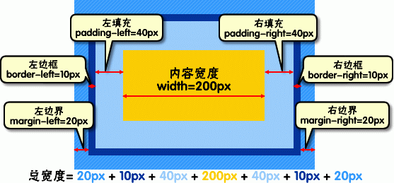

段落

非常自然，一行文字就是一个段落。  
如果你需要另起一段，请在两个段落之间隔一个空行。  
不隔一个空行的换行行为，在一些编辑器中被解释为换行，即插入一个\<br />标签。  
对与另外一些编辑器，会被解释为插入一个空格。对于后者，若要插入换行标签，请在当前一行的结尾打两个空格。

粗体、斜体  
可以使用星号*或下划线_指定粗体或者斜体。

*这是斜体*  
_这也是斜体_  
**这是粗体**  
***这是粗体+斜体***  

删除线  
一部分编辑器支持删除线，它不是经典markdown中的要素。用波浪线~定义删除线。  
~~就像这样~~

标题  
markdown总支持1~6六级标题，通过在一行之前加上不同数量的井号来表示。

# 这是 H1 #

## 这是 H2 ##

### 这是 H3 ###

...

###### 这是 H6 ######
行尾可以加上任意数量的井号字符，这些字符不会算作标题内容。通常会加上相等数量的字符以保持对称。  
此外，H1和H2也可以采用在文本下方添加底线来实现，比如：

这是 H1
=======

这是 H2
-------

引用  
通过在行首加上大于号>来添加引用格式。
> This is a blockquote with two paragraphs. Lorem ipsum dolor sit amet,
consectetuer adipiscing elit. Aliquam hendrerit mi posuere lectus.
Vestibulum enim wisi, viverra nec, fringilla in, laoreet vitae, risus.

> Donec sit amet nisl. Aliquam semper ipsum sit amet velit. Suspendisse
id sem consectetuer libero luctus adipiscing.

引用可以嵌套：
> This is the first level of quoting.
>
> > This is nested blockquote.
>
> Back to the first level.

也可以嵌套其他格式：

> ## 这是一个标题。
>
> 1.   这是第一行列表项。
> 2.   这是第二行列表项。
>
> 给出一些例子代码：
>
>     return shell_exec("echo $input | $markdown_script");

列表  
无序列表使用星号、加号或是减号作为列表标记：
*   Red
*   Green
*   Blue

有序列表则使用数字接着一个英文句点：
1.  Bird
1.  McHale
3.  Parish

 代码区域

有两种方式标记代码区域，原生风格是行首缩进死个空格。

    var d1=new Array();
    var j=0

还有一种是github的风格，代码段的前后用三个反引号独占一行来标记。
```
for(var i=0; i<infos.length; i++){
    if(infos[i][3]=='大一'){
        d1[j]=i;
        j++;
    }
    
}
```
分隔线  
    你可以在一行中用三个以上的星号、减号、底线来建立一个分隔线，行内不能有其他东西。你也可以在星号或是减号中间插入空格。下面每种写法都可以建立分隔线：
* * *
***
*****
- - -
---------------------------------------  
表格  
    表格是github风格独有的语法，但近年来渐渐被大多数编辑器支持。
| Item     | Value | Qty   |
| :------- | ----: | :---: |
| Computer | $1600 |  5    |
| Phone    | $12   |  12   |
| Pipe     | $1    |  234  |

链接  
[an example](http://example.com/)  
[an example](http://example.com/ "Optional Title")

自动链接  
    如果链接的地址和名字重复，可以用尖括号语法将其简化。  
<http://example.com/>

图像  
  


换行  
    隔一空行  
    当前一行的结尾打两个空格  

vscode  
    视图之间切换，请在编辑器中按Ctrl + Shift + V
